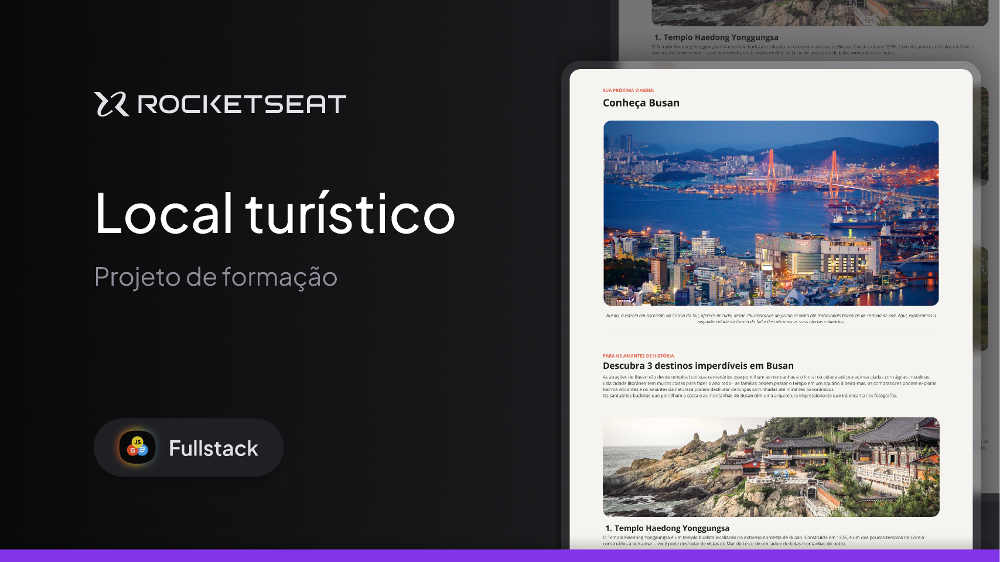

### Desafio prático - Local Turístico

  

 

🚀 Tecnologias
Esse projeto foi desenvolvido com as seguintes tecnologias:

HTML e CSS
Git e Github
Figma

 

💻 Projeto
Página web com informações sobre um determinado local turístico.

Feito com ♥ por mim.
